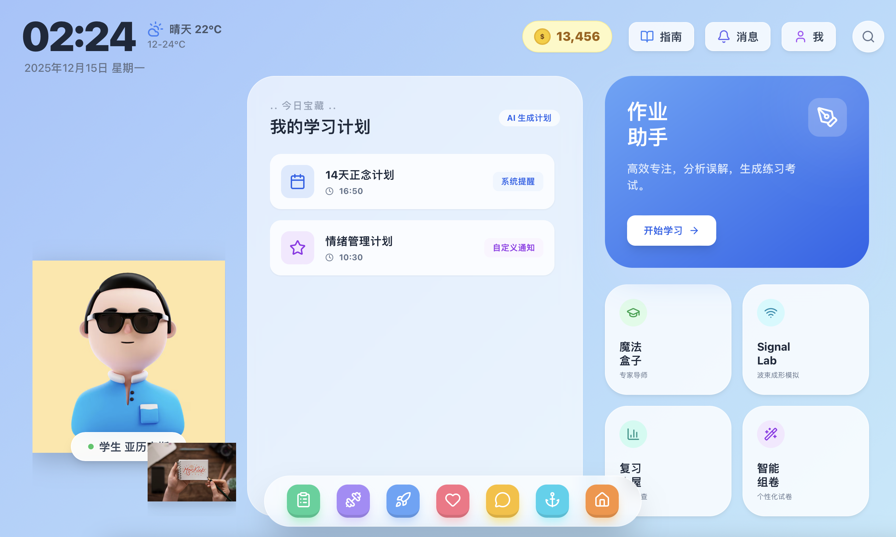

<div align="center">


# 崇新学堂 信息基础II 课程大作业
### 电信 AI 智能教育助手 (TelecomAI Intelligent Education Agent)

[**🌐 在线演示 (yjmjhznb.top)**](https://yjmjhznb.top)

</div>

## 📖 项目介绍

本项目是 **崇新学堂 信息基础II** 课程的大作业，旨在打造一个未来的、沉浸式的 AI 辅助电子信息教育平台。通过模拟桌面操作系统的交互体验，结合先进的生成式 AI 技术与手势交互实验，为学生和教师提供一个全方位的智能教与学环境。

## ✨ 核心功能

### 🖥️ 沉浸式桌面 OS 体验
- **现代化 UI 设计**：采用高端的玻璃态（Glassmorphism）设计风格，视觉效果惊艳。
- **交互式桌面**：具备 macOS 风格的动态 Dock 栏、顶部菜单栏和多窗口管理系统。
- **流畅体验**：精心设计的微交互，模拟真实操作系统的使用感受。

### 🤖 强大的 AI 智能助手
- **多模型支持**：支持 **Google Gemini** 及 **DeepSeek** 等先进大模型。
- **智能对话**：即时解答电子信息专业问题，支持复杂的概念解释与公式推导。
- **自动出题**：AI 根据通过知识点自动生成测验和考试题目，并提供详细解析。

### 🖐️ 波束成形 3D 实验室
- **手势控制**：基于 **MediaPipe** 的计算机视觉技术，无需额外硬件即可通过摄像头手势控制实验参数。
- **物理仿真**：实时计算相控阵波束成形，可视化电磁波传播和指向。
- **虚实结合**：将抽象的电信原理转化为直观的互动体验。

### 📊 数据可视化与学习分析
- **知识图谱**：使用雷达图直观展示知识点掌握情况。
- **学习追踪**：实时跟踪学习进度和状态，生成周表现趋势图。
- **误解分析**：智能识别学习中的常见误解，并提供针对性的补救建议。

### 👥 多角色系统
- **角色切换**：一键切换“学生”与“教师”视角。
- **差异化功能**：学生专注学习与练习，教师专注考试管理与学情分析。

## 🛠️ 技术栈

- **核心框架**: React 19, TypeScript, Vite
- **样式**: Tailwind CSS (Glassmorphism Design)
- **AI 集成**: Google GenAI SDK, OpenAI SDK (兼容 DeepSeek)
- **视觉交互**: MediaPipe Hands
- **文档渲染**: React Markdown, Rehype Highlight
- **图表**: Recharts

## 🚀 本地运行

1. **安装依赖**
   ```bash
   npm install
   ```

2. **配置环境变量**
   复制 `.env.local.example` 为 `.env.local` 并配置您的 API Key：
   ```bash
   cp .env.local.example .env.local
   # 编辑文件填入 GEMINI_API_KEY 或 DEEPSEEK_API_KEY
   ```

3. **启动开发服务器**
   ```bash
   npm run dev
   ```

## ❤️ 致谢

特别感谢以下工具和平台对本项目开发的强力支持：

- **Cursor**: 强大的 AI 代码编辑器，极大地提升了开发效率。
- **Antigravity**: 卓越的 Agentic AI 助手，协助完成了复杂的逻辑实现与系统构建。
- **Codex**: 提供了代码生成的底层支持。

---

*Directed by 崇新学堂 信息基础II*
